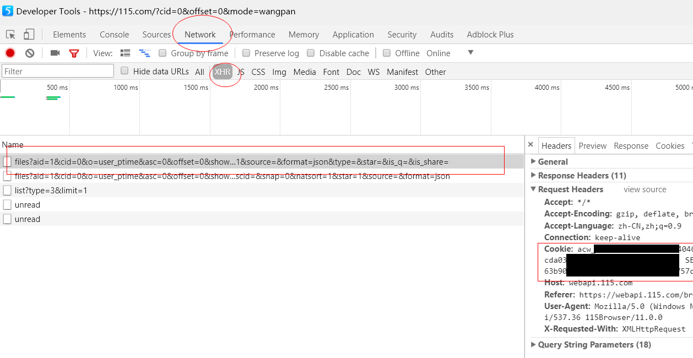

# 115Rename

为网盘文件夹里的日本电影批量重命名。

感谢原始项目：
<a title="Fake115Upload" target="_blank" href="https://github.com/T3rry7f/Fake115Upload">Fake115Upload</a> 和
<a title="AV Data Capture (CLI)" target="_blank" href="https://github.com/yoshiko2/AV_Data_Capture">AV Data Capture (CLI)</a>

本项目是
<a title="Fake115Upload" target="_blank" href="https://github.com/LSD08KM/Fake115Upload_Python3">Fake115Upload_Python3</a> 和
<a title="AV Data Capture (CLI)" target="_blank" href="https://github.com/LSD08KM/115_Code_Rename">115_Code_Rename</a>的结合。
若想实现影片分类功能，请手动使用这两个工具。

# 下载

[Windows版](https://github.com/LSD08KM/115rename/releases)

其他系统请clone源码包运行，并手动安装Python3环境

# 如何使用
## 注意事项，必读！

旧文件名必须满足<a title="Hits" target="_blank" href="https://github.com/yoshiko2/AV_Data_Capture"> AV Data Capture (CLI) </a>的条件：文件名中间要有下划线或者减号"_","-"，没有多余的内容只有番号为最佳。

##### 本软件的运行原理：

运行步骤1：将网盘文件夹里的所有文件（包括子文件夹里的文件）的转存链保存到本地文档里。

运行步骤2：给转存链重命名。

运行步骤3：利用转存链，把重命名后的文件们存到网盘的指定文件夹里。

起到间接重命名网盘文件的作用。**并不会把原文件删除。**

重命名失败的文件会和成功文件存在一起。

## 简要教程:

1. 修改config.ini里的参数：COOKIES、getcid和upcid。
2. 设置 config.ini 文件的代理（路由器拥有自动代理功能的可以把 proxy= 后面内容去掉）
3. 运行软件等待完成

# 完整使用文档


## 配置文件config.ini
### 配置文件的参数
**只有下面的几项有必要修改，不要改动其他的参数！**

```
[auto]
mode=1	#运行模式

[webhard]
COOKIES=	#填写自己的COOKIES，下面有详细说明
getcid=0	#重命名哪个网盘文件夹的文件
upcid=0		#重命名后的文件存到哪个网盘文件夹（不建议保存到原始文件夹！可能会造成文件混乱）

[Name_Rule]
naming_rule=number+' '+actor+' '+title		#重命名规则
```
### 运行模式

mode=1时，重命名后存到网盘文件夹。

mode=2时，不存回网盘，只在生成本地文件，本地文件是什么下面有说明。


### COOKIES在哪里：

在115浏览器打开网盘文件夹，点击键盘F12，出现DeveloperTools。再刷新网页，看DeveloperTools的Network栏，点击下面Name列表里files?开头的条目，右侧图中圈出的就是COOKIES。复制到配置文件即可。


### CID在哪里：

CID就是每个网盘文件夹的内部编号。

在地址栏可以看到。

图中cid=0，即当前网页打开的网盘文件夹目录的cid是0。

### 重命名规则

#### 命名参数

```
title = 片名
actor = 演员
studio = 公司
director = 导演
release = 发售日
year = 发行年份
number = 番号
cover = 封面链接
tag = 类型
outline = 简介
runtime = 时长
```

上面的参数以下都称之为**变量**

#### 例子：
自定义规则方法：有两种元素，变量和字符，无论是任何一种元素之间连接必须要用加号 **+** ，比如：```'naming_rule=['+number+']-'+title```，其中冒号 ' ' 内的文字是字符，没有冒号包含的文字是变量，元素之间连接必须要用加号 **+** 

**影片命名规则：**默认 ```naming_rule=number+' '+actor+' '+title```

#### 注意：

重命名不能包含/:*?"<>|。&

## 本地文件

了解软件的运行原理后可以知道，运行软件会产生本地文档。

本地文档共三个：

```
115links.txt	#保存原始转存码。在软件文件夹里。
RenameSu.txt	#保存重命名后的转存码。AV_output文件夹里。
115upfailed.txt	#保存重命名失败的转存码。在软件目录里。
```


为了方便手动校对，软件不会删除这些文档。
软件运行结束后，如果觉得没用了，请自行删除。


## 多集影片处理

可以把多集电影按照集数后缀命名为类似`ssni-xxx-cd1.mp4m,ssni-xxx-cd2.mp4，abp-xxx-CD1.mp4`的规则，只要含有`-CDn./-cdn.`类似命名规则，即可使用分集功能

## 中文字幕处理

当文件名包含: 中文，字幕，-c., -C., 会在番号后添加-C后缀。

处理元数据时会加上**中文字幕**标签。

## 本地旧文件处理

当该软件目录存在以前的输出文档或文件夹，例如`115failed.txt`或`AV_output`文件夹。会将旧文件重命名，例如`AV_output_20200411170755`，以防文件混乱。

没用的txt文档可以随时自行删除，不影响软件运行。
